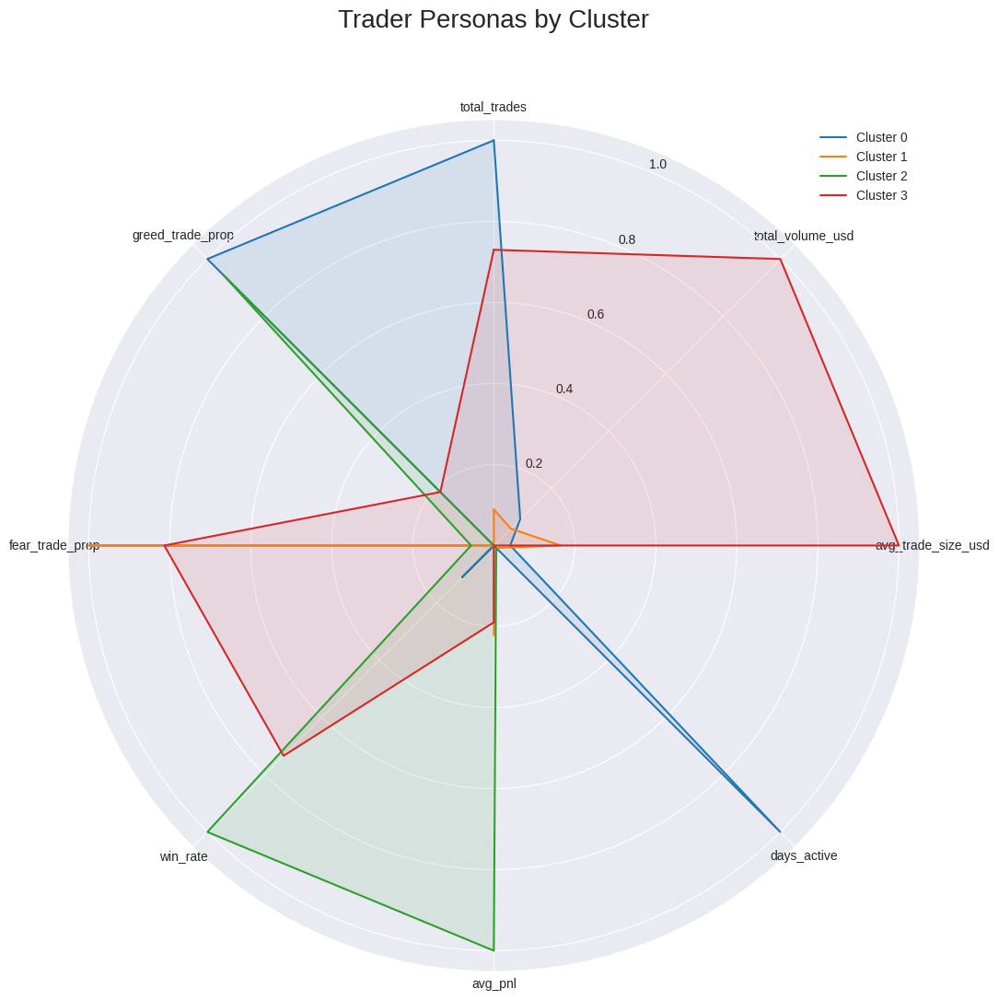
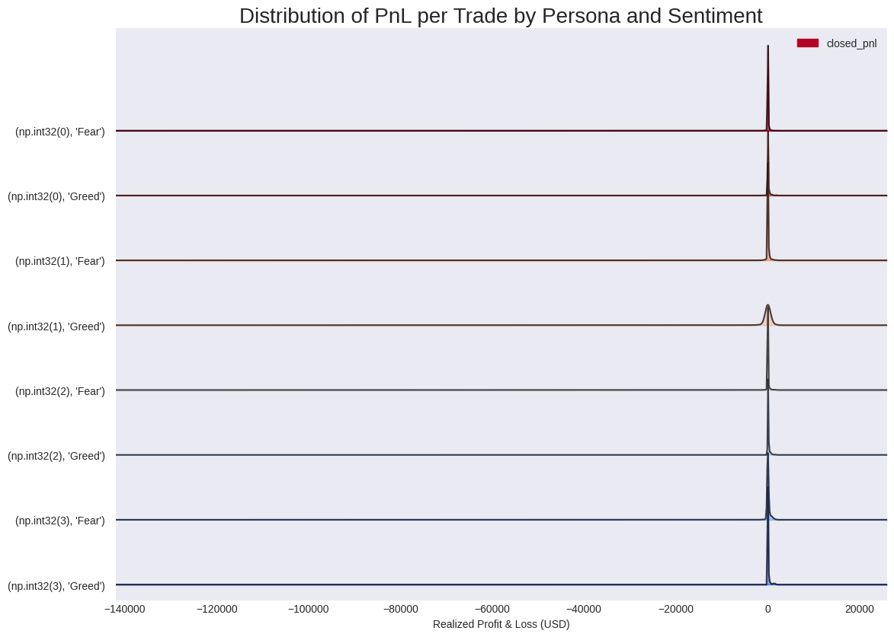
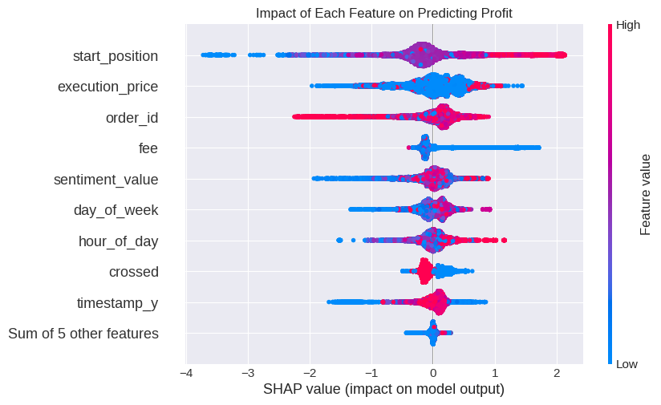

# Trader Behavior Analysis vs. Market Sentiment

[](https://www.python.org/)
[](https://pandas.pydata.org/)
[](https://scikit-learn.org/)
[](https://lightgbm.readthedocs.io/en/latest/)
[](https://shap.readthedocs.io/en/latest/)

### **Project Goal:** To move beyond generic market indicators and develop a deep, strategic understanding of the crypto market by analyzing who wins, when, and why.

This project dissects the market into an ecosystem of distinct trader "personas" using unsupervised machine learning. It then leverages a predictive model with state-of-the-art SHAP explainability to quantify the precise drivers of a trade's success, providing a framework for creating highly adaptive and intelligent trading signals.

---

## 🚀 Key Insights at a Glance

* **🐋 Persona-Driven Markets:** The market isn't a single entity; it's a dynamic ecosystem of competing personas. "Momentum Whales" dominate during greed, while "Cautious Contrarians" find unique opportunities during fear.

* **🐻 Contrarians Win in Fear:** The data conclusively shows that the "Cautious Contrarian" persona is the only group to achieve consistent profitability during periods of market fear, confirming the viability of a "buy the dip" strategy *for this specific persona*.

* **💰 Key Drivers of Profit, Quantified:** SHAP analysis revealed that the success of a trade is most heavily influenced by **Trade Size**, the prevailing **Market Sentiment**, and the trade's **Starting Position**.

---

## 📊 Visualizations Gallery

A showcase of the key analytical outputs from the project.

<table>
  <tr>
    <td align="center"><b>Time Series: Volume vs. Sentiment</b></td>
    <td align="center"><b>Trader Personas (Radar Chart)</b></td>
  </tr>
  <tr>
    <td><a href="./outputs/time_series_volume_vs_sentiment.png"></a></td>
    <td><a href="./outputs/trader_persona_radar_chart.png"></a></td>
  </tr>
  <tr>
    <td align="center"><b>Profitability Distribution (Ridgeline Plot)</b></td>
    <td align="center"><b>SHAP: Drivers of Profitability</b></td>
  </tr>
  <tr>
    <td><a href="./outputs/pnl_distribution_ridgeline_plot.png"></a></td>
    <td><a href="./outputs/shap_summary_dot_plot.png"></a></td>
  </tr>
</table>

---

## 🛠️ Technology Stack

| Category                  | Tools & Libraries                                     |
| :------------------------ | :---------------------------------------------------- |
| **Data Manipulation** | `Python`, `Pandas`, `NumPy`                           |
| **Data Visualization** | `Matplotlib`, `Seaborn`, `JoyPy`                      |
| **Machine Learning** | `Scikit-Learn` (for Clustering), `LightGBM` (for Classification) |
| **Model Explainability** | `SHAP` (SHapley Additive exPlanations)                |
| **Environment** | `Google Colab` / `Jupyter Notebook`                   |

<br>

<details>
<summary><b>Click to view Project Methodology</b></summary>

The analysis follows a multi-stage pipeline, with each stage building upon the last to deliver progressively deeper insights.

1.  **Data Preprocessing & Merging:** Raw transactional data and daily sentiment scores were cleaned, standardized, and merged into a unified analytical dataset.
2.  **Exploratory Analysis (EDA):** A high-level market analysis to identify broad correlations between sentiment, volume, and profitability.
3.  **Unsupervised Clustering for Persona Discovery:** Engineered behavioral features for each trader, then applied K-Means clustering to segment them into distinct "personas."
4.  **Predictive Modeling & Explainability:** Trained a LightGBM Classifier to predict trade profitability, then used SHAP to explain the model's predictions and identify key drivers of success.

</details>

<details>
<summary><b>Click to view Setup & Execution Guide</b></summary>

1.  **Clone or Download the Repository:**
    ```bash
    git clone [https://github.com/ShreyasVN/Trader-Behavior-Analysis-Submission.git](https://github.com/ShreyasVN/Trader-Behavior-Analysis-Submission.git)
    cd Trader-Behavior-Analysis-Submission
    ```
2.  **Environment:** The project is designed for a **Google Colab** environment.
3.  **Setup:**
    * Launch `notebook_1.ipynb` in Google Colab.
    * Upload the two data files from the `csv_files` directory (`historical_data.csv` and `fear_greed_index.csv`) to the root directory of your Colab session.
4.  **Execution:**
    * Run the notebook cells sequentially from top to bottom. The code is structured to load data, perform all analyses, and generate the visualizations found in the `outputs` folder.

</details>

## 📫 Contact

* **Shreyas N**
* **GitHub:** [ShreyasVN](https://github.com/ShreyasVN)
