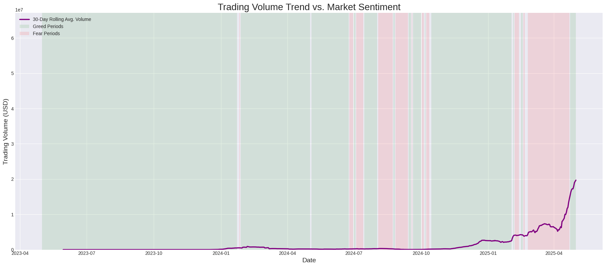

# Trader Behavior Analysis vs. Market Sentiment

This repository contains a comprehensive data science project analyzing the intricate relationship between crypto trader behavior and the prevailing market sentiment (Fear vs. Greed). The goal is to move beyond surface-level metrics to uncover actionable, data-driven insights for developing smarter, adaptive trading strategies.

---

## Key Visualizations Gallery

A showcase of the key analytical outputs from the project.

<table>
  <tr>
    <td align="center"><b>Time Series: Volume vs. Sentiment</b></td>
    <td align="center"><b>Trader Personas (Radar Chart)</b></td>
  </tr>
  <tr>
    <td></td>
    <td></td>
  </tr>
  <tr>
    <td align="center"><b>Profitability Distribution (Ridgeline Plot)</b></td>
    <td align="center"><b>SHAP: Drivers of Profitability</b></td>
  </tr>
  <tr>
    <td></td>
    <td></td>
  </tr>
</table>

---

## Project Overview

This project deconstructs the market into an ecosystem of distinct trader "personas" to understand who wins, when, and why. By blending time-series analysis, unsupervised machine learning, and state-of-the-art model explainability, we can answer critical questions:

-   How does trading volume and profitability correlate with market-wide fear and greed?
-   Can we identify distinct groups of traders based on their unique behavioral patterns?
-   Which trader personas are most successful during market volatility versus market rallies?
-   What are the most significant, quantifiable drivers of a successful trade?

## Methodology

The analysis follows a multi-stage pipeline, with each stage building upon the last to deliver progressively deeper insights.

| Stage                                     | Description                                                                                                                                                             | Key Techniques Used                                        |
| :---------------------------------------- | :---------------------------------------------------------------------------------------------------------------------------------------------------------------------- | :--------------------------------------------------------- |
| **1. Data Preprocessing & Merging** | Raw transactional data and daily sentiment scores were cleaned, standardized, and merged into a unified analytical dataset.                                               | `Pandas` for data manipulation.                            |
| **2. Exploratory Analysis (EDA)** | A high-level market analysis to identify broad correlations between sentiment, volume, and profitability.                                                               | `Matplotlib`, `Seaborn` for time-series visualization.     |
| **3. Unsupervised Clustering** | Engineered behavioral features for each trader, then applied K-Means clustering to segment them into distinct "personas."                                                  | `Scikit-learn` for `StandardScaler` and `KMeans`.          |
| **4. Predictive Modeling & Explainability** | Trained a LightGBM Classifier to predict trade profitability, then used SHAP to explain the model's predictions and identify key drivers of success.                      | `LightGBM` for classification, `SHAP` for explainability.  |

## Key Findings

1.  **Contrarian Market Structure:** The market exhibits strong contrarian signals. Average trade sizes are largest during **Fear**, while selling pressure peaks during **Greed**, indicating systematic profit-taking into rallies.

2.  **Four Distinct Trader Personas Discovered:**
    * **High-Volume Momentum Whales:** High-capital traders who excel during market greed by riding momentum.
    * **Cautious Contrarians:** Highly effective traders with a superior win rate who are uniquely profitable during market fear.
    * **Low-Impact Retail:** Infrequent, low-volume traders who struggle to find a consistent edge.
    * **Active Scalpers:** High-frequency traders whose profitability is often negated by transaction costs.

3.  **Profitability is Persona & Context-Dependent:** No single strategy is universally superior. The analysis proves that a trader's success is a function of aligning their inherent persona with the correct market environment.

4.  **Key Drivers of Profitability Identified:** The SHAP analysis quantified the most important factors in predicting a profitable trade. **Trade size (`size_usd`)**, **market sentiment (`sentiment_value`)**, and a trade's **starting position** were determined to be the most influential predictors.

## How to Run the Code

1.  **Environment:** The project was developed in a **Google Colab** environment.
2.  **Setup:**
    * Launch `notebook_1.ipynb` in Google Colab.
    * Upload the two data files from the `csv_files` directory (`historical_data.csv` and `fear_greed_index.csv`) to the root directory of your Colab session.
3.  **Execution:**
    * Run the notebook cells sequentially from top to bottom. The code is structured to install dependencies, load data, perform all analyses, and generate the visualizations found in the `outputs` folder.

## Author

* **Shreyas N**
